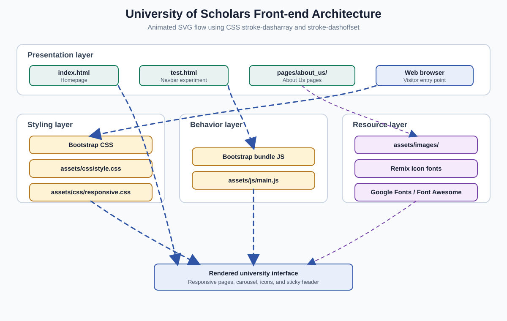

# Contents

- [University of Scholars](#university-of-scholars)
- [Description](#description)
- [Key Features](#key-features)
- [Tech Stack](#tech-stack)
- [Getting Started](#getting-started)
  - [Prerequisites](#prerequisites)
  - [Installation](#installation)
  - [Run](#run)
- [Environment Variables](#environment-variables)
- [Usage / Examples](#usage--examples)
- [Sequential Setup and Tools Guide](#sequential-setup-and-tools-guide)
- [Page-by-Page Guide](#page-by-page-guide)
- [Animated Data Flow Diagram](#animated-data-flow-diagram)
- [Animated Architecture Diagram](#animated-architecture-diagram)
- [Project Structure](#project-structure)
- [Page Inventory](#page-inventory)
- [Planned Alternatives](#planned-alternatives)
- [License](#license)

# University of Scholars

## Description

University of Scholars is a responsive static university website prototype for prospective students, current students, faculty, alumni, and visitors. It presents institutional information, academic departments, leadership messages, campus resources, notices, activities, and admission-focused content in a single browsable site.

## Key Features

- **Institutional overview:** Introduces the university, its mission, vision, history, leadership, and governance topics.
- **Academic showcase:** Displays departments and programs including CSE, EEE, Textile Engineering, English, BBA, and MBA.
- **Leadership section:** Presents chairman and vice-chancellor profile cards with message and profile entry points.
- **Content highlights:** Includes sections for notices, recorded classrooms, blogs, admission, campus life, clubs, student support, alumni, collaboration, accreditation, and committees.
- **Responsive foundation:** Uses Bootstrap’s responsive layout utilities with project-specific CSS styling.
- **Visual presentation:** Includes a rotating hero carousel, local image assets, icons, hover states, and a sticky main header on scroll.
- **Static page scaffold:** Provides an About Us page directory for future institutional detail pages.

## Tech Stack

| Layer           | Technology                           |
| --------------- | ------------------------------------ |
| Markup          | HTML5                                |
| Styling         | CSS3, Bootstrap 5.3.3                |
| Client behavior | Vanilla JavaScript                   |
| Icons           | Remix Icon, Font Awesome CDN         |
| Typography      | Roboto via Google Fonts CDN          |
| Assets          | Local images, SVGs, and vendor files |

## Getting Started

### Prerequisites

- A modern browser such as Chrome, Edge, Firefox, or Safari.
- Optional: Python 3 for serving the site over localhost. A local HTTP server is recommended for consistent browser behavior.
- Internet access for the Font Awesome and Google Fonts CDN resources used by `index.html`.

### Installation

Clone the repository and enter the project directory:

```bash
git clone <repository-url>
cd University-of-Scholars
```

This project has no package manager dependencies or build step. Bootstrap and Remix Icon are already included in `vendor/`.

### Run

Start a local static server from the project root:

```bash
python -m http.server 8000
```

Open the homepage at [http://localhost:8000](http://localhost:8000). Stop the server with `Ctrl+C`.

Alternatively, open `index.html` directly in a browser or use a VS Code static-server extension.

## Environment Variables

No environment variables are required. The project is a static front-end prototype and currently has no API, database, authentication, or server-side configuration.

```env
# No variables required
```

## Usage / Examples

### Open the homepage

```text
http://localhost:8000/index.html
```

### Open an About Us route

The following routes are present as page placeholders and can be opened directly when served locally:

```text
http://localhost:8000/pages/about_us/campus.html
http://localhost:8000/pages/about_us/history_vission.html
http://localhost:8000/pages/about_us/chancellor.html
http://localhost:8000/pages/about_us/vice_chancellor.html
```

Additional About Us page placeholders include `bord_of_trustees.html`, `legislative_documents.html`, `pro_vice_chancellor.html`, `standing_committees.html`, `treasure.html`, and `working_in_students.html`.

### Update the site

1. Edit content in `index.html`.
2. Add or update visual rules in `assets/css/style.css` and `assets/css/responsive.css`.
3. Update scroll behavior in `assets/js/main.js`.
4. Place new visual assets in `assets/images/`.
5. Refresh the browser and verify desktop and mobile layouts.

## Sequential Setup and Tools Guide

Follow these steps from the repository root. The project does not use Node.js, npm, a bundler, or a framework build command.

### Step 1: Confirm the repository root

All relative paths in the HTML files are resolved from the project root. Confirm that the main entry point and asset directories are available before starting a server.

```text
University-of-Scholars/
├── index.html
├── assets/
├── pages/
└── vendor/
```

On Windows PowerShell, move to the root directory with:

```powershell
Set-Location "C:\path\to\University-of-Scholars"
Get-ChildItem
```

### Step 2: Install or verify a browser

Use a current browser to test the carousel, responsive navbar, hover states, external fonts, and sticky header behavior.

```text
Supported examples:
- Microsoft Edge
- Google Chrome
- Mozilla Firefox
- Safari
```

Open browser developer tools with `F12` to inspect layout, console messages, failed assets, and responsive breakpoints.

### Step 3: Install or verify Python

Python is optional, but its built-in HTTP server is the simplest way to serve this static site locally. Verify the installation:

```powershell
py --version
```

If `py` is unavailable, try:

```powershell
python --version
```

### Step 4: Start the local HTTP server

Run the server from the repository root so paths such as `assets/images/logo.png` resolve correctly:

```powershell
py -m http.server 8000
```

If the `py` launcher is unavailable, use:

```powershell
python -m http.server 8000
```

Keep this terminal open while browsing. Stop the server with:

```text
Ctrl+C
```

Then visit:

```text
http://localhost:8000/
```

### Step 5: Load the main HTML page

The browser loads `index.html`, which provides the homepage structure, navigation, hero carousel, academic program cards, leadership cards, content highlights, and footer.

```text
http://localhost:8000/index.html
```

### Step 6: Use the local Bootstrap distribution

Bootstrap is committed locally, so no package installation is needed. `index.html` references:

```html
<link rel="stylesheet" href="vendor/bootstrap-5.3.3/css/bootstrap.min.css" />
<script src="vendor/bootstrap-5.3.3/js/bootstrap.bundle.min.js"></script>
```

Bootstrap supplies the grid, containers, navbar collapse behavior, carousel, cards, spacing utilities, and responsive classes used by the homepage.

### Step 7: Use the local Remix Icon distribution

Remix Icon is also committed locally and is loaded with:

```html
<link rel="stylesheet" href="vendor/RemixIcon_Fonts/remixicon.css" />
```

Icons are selected through classes such as:

```html
<i class="ri-arrow-right-line" aria-hidden="true"></i>
```

Keep the vendor path unchanged unless the icon package is intentionally replaced.

### Step 8: Load external font and icon resources

The homepage additionally loads Roboto from Google Fonts and Font Awesome from a CDN:

```html
<link
  href="https://fonts.googleapis.com/css2?family=Roboto:ital,wght@0,100..900;1,100..900&display=swap"
  rel="stylesheet"
/>
<link
  rel="stylesheet"
  href="https://cdnjs.cloudflare.com/ajax/libs/font-awesome/6.7.2/css/all.min.css"
/>
```

These resources require internet access. If they fail, the page still loads, but typography or social icons may look different.

### Step 9: Apply project CSS

The custom stylesheets load after Bootstrap so project rules can customize the site:

```html
<link rel="stylesheet" href="assets/css/style.css" />
<link rel="stylesheet" href="assets/css/responsive.css" />
```

Use `style.css` for shared layout, colors, typography, sections, cards, and footer styles. Use `responsive.css` for breakpoint-specific overrides. The current responsive stylesheet is an extension point and may be empty.

### Step 10: Run the JavaScript behavior

`assets/js/main.js` is plain browser JavaScript. It finds `.main_header`, listens for scrolling, and toggles `.sticky` after the page passes the header height:

```javascript
const mainHeader = document.querySelector(".main_header");

window.addEventListener("scroll", function () {
  if (window.scrollY > mainHeader.offsetHeight) {
    mainHeader.classList.add("sticky");
  } else {
    mainHeader.classList.remove("sticky");
  }
});
```

No JavaScript installation or compilation is required. If the header behavior changes, edit this file and refresh the browser.

### Step 11: Add and reference local assets

Place images and SVG files in `assets/images/`, then reference them with paths relative to the page that uses them:

```html

```

For a page inside `pages/about_us/`, the equivalent path must move up two directories:

```html

```

Use descriptive `alt` text and confirm the filename’s capitalization matches the actual asset filename.

### Step 12: Use the navbar test page

`test.html` is an isolated Bootstrap navbar experiment. It demonstrates hover underline styling and hover-triggered dropdown behavior with a CDN Bootstrap dependency.

```text
http://localhost:8000/test.html
```

Changes made in `test.html` do not automatically update the main homepage. Treat it as a development experiment unless its components are copied into `index.html` and the project’s local asset conventions are applied.

## Page-by-Page Guide

### 1. Homepage: `index.html`

This is the only currently populated primary page. Its main areas are:

```text
Header
	├── Contact and social links
	├── Login and Register Now placeholders
	└── About us, Academics, Admission, Administration, Activities,
			Publicity, and Convocation menus
Main content
	├── Hero image carousel
	├── About Us introduction
	├── Courses and Programs
	├── Chairman and Vice Chancellor messages
	└── Notice, classroom, blog, admission, campus, club, support,
			alumni, collaboration, accreditation, and committee highlights
Footer
```

Open it with:

```text
http://localhost:8000/index.html
```

Many navigation and content actions currently use `href="#"`. Replace those placeholders with real routes when the corresponding pages or backend integrations are implemented.

### 2. Navbar experiment: `test.html`

This page is a standalone test surface for a responsive navbar, dropdown menus, and hover underline transitions. It is not linked from the homepage.

```text
http://localhost:8000/test.html
```

### 3. About Us pages

The following files exist as page placeholders. They should be populated with complete HTML documents before being exposed as production navigation targets:

```text
pages/about_us/bord_of_trustees.html
pages/about_us/campus.html
pages/about_us/chancellor.html
pages/about_us/history_vission.html
pages/about_us/legislative_documents.html
pages/about_us/pro_vice_chancellor.html
pages/about_us/standing_committees.html
pages/about_us/treasure.html
pages/about_us/vice_chancellor.html
pages/about_us/working_in_students.html
```

When a file is implemented, open it through the local server with this pattern:

```text
http://localhost:8000/pages/about_us/<page-name>.html
```

For example:

```text
http://localhost:8000/pages/about_us/campus.html
```

Each nested page should use correct relative paths. A stylesheet reference from `pages/about_us/` needs `../../assets/css/style.css`, and a local Bootstrap reference needs `../../vendor/bootstrap-5.3.3/css/bootstrap.min.css`.

### 4. Page implementation sequence

Use this order when turning the placeholders into working pages:

```text
1. Copy the shared document structure from index.html.
2. Update the <title> and page-specific heading.
3. Change root-relative asset paths to ../../assets/ and ../../vendor/.
4. Add the page content and accessible headings.
5. Add a working link from the relevant homepage menu or content card.
6. Open the route through localhost and check the browser console.
7. Test the page at desktop and mobile viewport widths.
```

### 5. Verification checklist

Run these checks after changing a page or tool file:

```text
1. Confirm the page opens through http://localhost:8000/.
2. Check that CSS, JavaScript, images, fonts, and icons load without 404 errors.
3. Resize the browser and verify the navbar and content remain usable.
4. Scroll the homepage and confirm the main header becomes sticky.
5. Activate carousel controls and inspect all slides.
6. Test every newly implemented link instead of leaving placeholder # targets.
7. Review keyboard focus, image alternative text, and heading order.
```

## Animated Data Flow Diagram

```mermaid
---
title: University of Scholars static-site data flow
config:
	flowchart:
		curve: basis
---
flowchart LR
		V[Visitor] --> B[Web browser]
		B --> H[index.html]
		H --> C[Bootstrap CSS and JS]
		H --> R[Remix Icon and CDN fonts]
		H --> S[style.css and responsive.css]
		H --> A[Local images and SVG assets]
		B --> J[main.js]
		J --> T[Sticky header state]
		H --> P[About Us HTML placeholders]
		C --> UI[Rendered university website]
		R --> UI
		S --> UI
		A --> UI
		T --> UI
		P --> UI

		classDef source fill:#e8f3f1,stroke:#13795b,stroke-width:1px;
		classDef process fill:#fff3d6,stroke:#b7791f,stroke-width:1px;
		classDef output fill:#e9eefb,stroke:#3155a6,stroke-width:1px;
		class H,C,R,S,A,J,P source;
		class B,T process;
		class V,UI output;
```

The browser loads the homepage, local styles, vendor libraries, JavaScript, and media assets. `main.js` observes scrolling and toggles the `sticky` class on the main header; the browser then renders the combined result. The diagram is renderer-animated where the Markdown host supports Mermaid motion, and remains fully readable as a static flowchart elsewhere.

## Animated Architecture Diagram

<p align="center">
  
</p>

[Open the animated SVG architecture diagram](assets/architecture-flow.svg)

This architecture diagram describes responsibilities rather than request payloads. The presentation layer contains the HTML pages, the styling and behavior layers enhance them, and the resource layer supplies local media, icons, and CDN assets. The arrows are SVG vector paths styled with CSS `stroke-dasharray` and animated `stroke-dashoffset`, creating moving line effects without losing image quality at different sizes. The SVG also respects `prefers-reduced-motion` by disabling animation when the visitor requests less motion. Markdown hosts that block animated SVG images can still open the source file directly or display its static vector frame.

## Project Structure

```text
.
├── index.html                    # Main homepage
├── test.html                     # Navbar hover/dropdown experiment
├── assets/
│   ├── css/style.css             # Main site styles
│   ├── css/responsive.css        # Responsive-style entry point
│   ├── architecture-flow.svg     # Animated architecture flowchart
│   ├── images/                   # Logos, banners, profiles, and content images
│   └── js/main.js                # Sticky header behavior
├── pages/about_us/               # About Us page placeholders
└── vendor/
		├── bootstrap-5.3.3/          # Local Bootstrap distribution
		└── RemixIcon_Fonts/           # Local Remix Icon distribution
```

## Page Inventory

The main entry point is [`index.html`](index.html). The About Us directory currently contains these page placeholders:

- [`bord_of_trustees.html`](pages/about_us/bord_of_trustees.html)
- [`campus.html`](pages/about_us/campus.html)
- [`chancellor.html`](pages/about_us/chancellor.html)
- [`history_vission.html`](pages/about_us/history_vission.html)
- [`legislative_documents.html`](pages/about_us/legislative_documents.html)
- [`pro_vice_chancellor.html`](pages/about_us/pro_vice_chancellor.html)
- [`standing_committees.html`](pages/about_us/standing_committees.html)
- [`treasure.html`](pages/about_us/treasure.html)
- [`vice_chancellor.html`](pages/about_us/vice_chancellor.html)
- [`working_in_students.html`](pages/about_us/working_in_students.html)

## Planned Alternatives

The following capabilities would be suitable for a production university portal but are not implemented in this repository:

- **CMS or headless CMS:** Manage notices, blogs, programs, and leadership content without editing HTML.
- **Application backend:** Add admissions workflows, form processing, an API, and database-backed content.
- **Authentication and role-based access:** Provide separate student, faculty, staff, and administrator portals.
- **Search and filtering:** Search departments, notices, pages, and downloadable documents.
- **Accessibility hardening:** Add a formal WCAG audit, keyboard interaction testing, focus management, and improved semantic navigation.
- **Performance delivery:** Add image optimization, caching, a build pipeline, and a CDN for production assets.
- **Automated quality checks:** Add HTML validation, CSS linting, JavaScript tests, and browser-based regression tests.
- **Deployment automation:** Add staging and production environments with CI/CD and uptime monitoring.

## License

This project is licensed under the MIT License. Add a `LICENSE` file containing the standard MIT License text before distributing the project publicly.

[Back to Contents](#contents)
